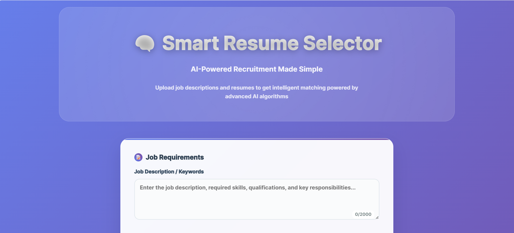

# 📄 Resume Ranking App with AI Analysis

An intelligent web application that ranks resumes based on a job description using AI (Gemini) and displays real-time progress using Server-Sent Events (SSE).

---

## 🚀 Features

- 🧠 AI-powered resume ranking (Gemini)
- 📄 PDF resume text extraction
- 🔁 Real-time progress updates (SSE)
- 📥 Batch upload of multiple resumes
- 📑 Generates a ranked PDF report
- ⚙️ Simple and clean UI

---

## 🛠️ Tech Stack

- **Backend**: Flask (Python)
- **Frontend**: HTML, CSS, Vanilla JS
- **AI**: Gemini
- **PDF Parsing**: `PyMuPDF`
- **PDF Report**: `FPDF`
- **Streaming**: Server-Sent Events (SSE)

---

## ⚙️ Setup

1. **Clone the repository**

```bash
git clone https://github.com/Znullptr/Smart-Resume-Selector.git
cd resume-ranker
```

2. **Create a virtual environment**

```bash
python -m venv venv
source venv/bin/activate
```

3. **Install dependencies**

```bash
pip install -r requirements.txt
```

4. **Configure your environement file**

Rename `.env.sample` to `.env` and fill in your keys:

```bash
SECRET_KEY = 'your-secure-key'
GEMINI_KEY = 'your-gemini-key'
```

5. **Run the app**

```bash
python app.py
```

6. **Visit in browser**

```
http://localhost:5000
```

---

## 📂 Project Structure

```
Smart-Resume-Selector/
├── templates/
│ └── index.html, results.html
├── resumes/
│ └── (uploaded resumes)
├── utils/
│ ├── gemini_ranker.py
│ ├── generate_pdf_report.py
│ └── resume_reader.py
├── app.py
├── requirements.txt
└── README.md
```

---

## 🖼️ Screenshots





---

## 📄 License

Licensed under the MIT License. See `LICENSE` for details.

---

## 👤 Author

**Tahar Jaafer**  
Data Engineer | AI Enthusiast  
[GitHub](https://github.com/Znullptr) • [LinkedIn](https://www.linkedin.com/in/tahar-jaafer-522569221)

---

## 🤝 Contributing

Pull requests are welcome! For major changes, please open an issue first.
